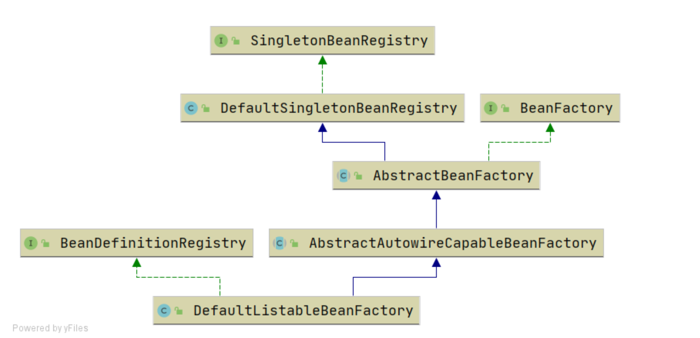
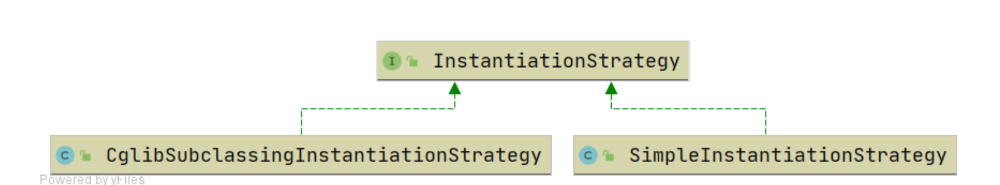
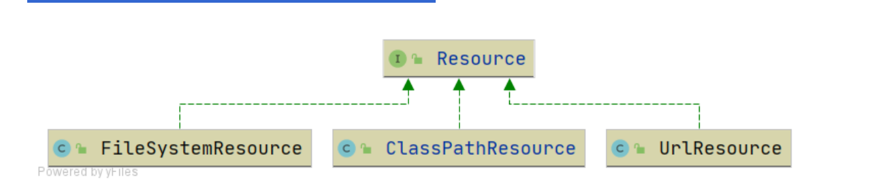
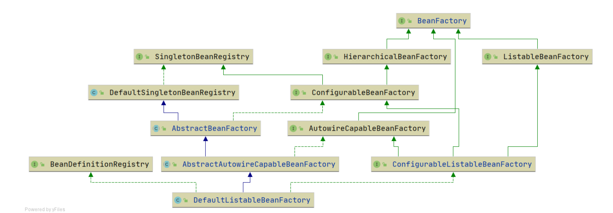
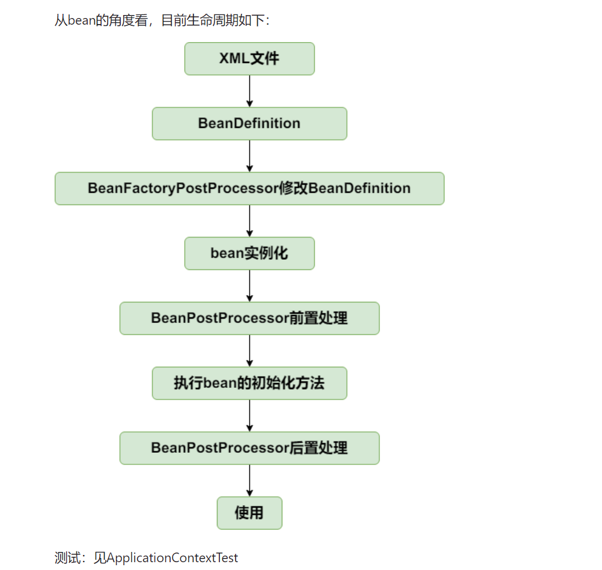
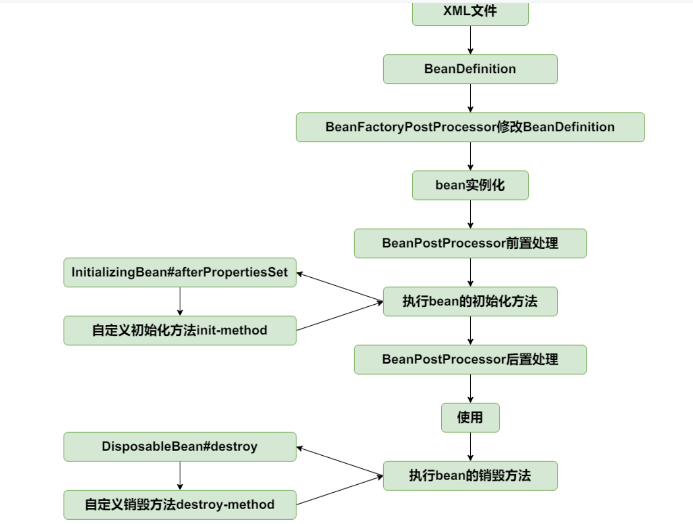
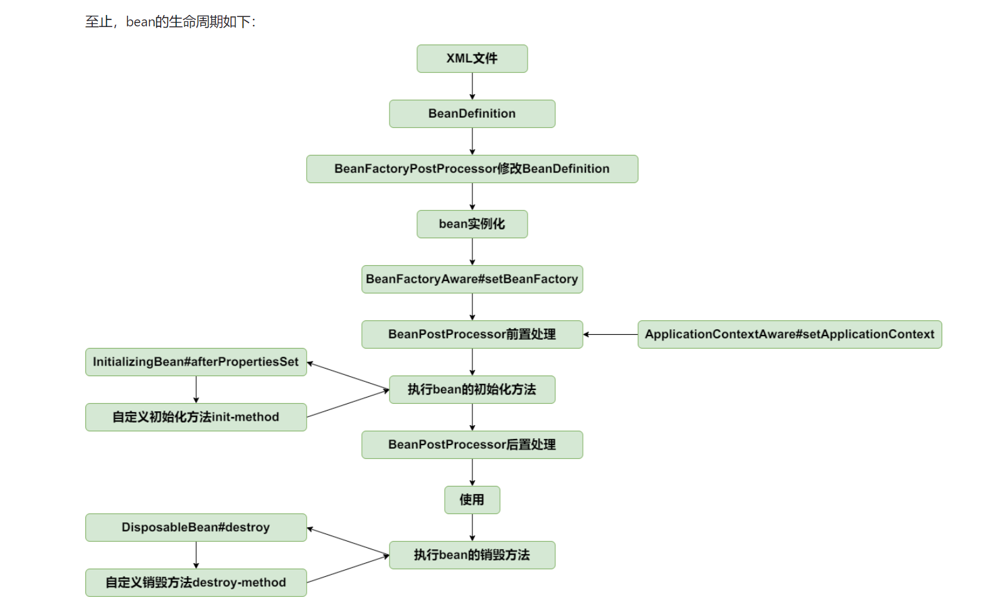
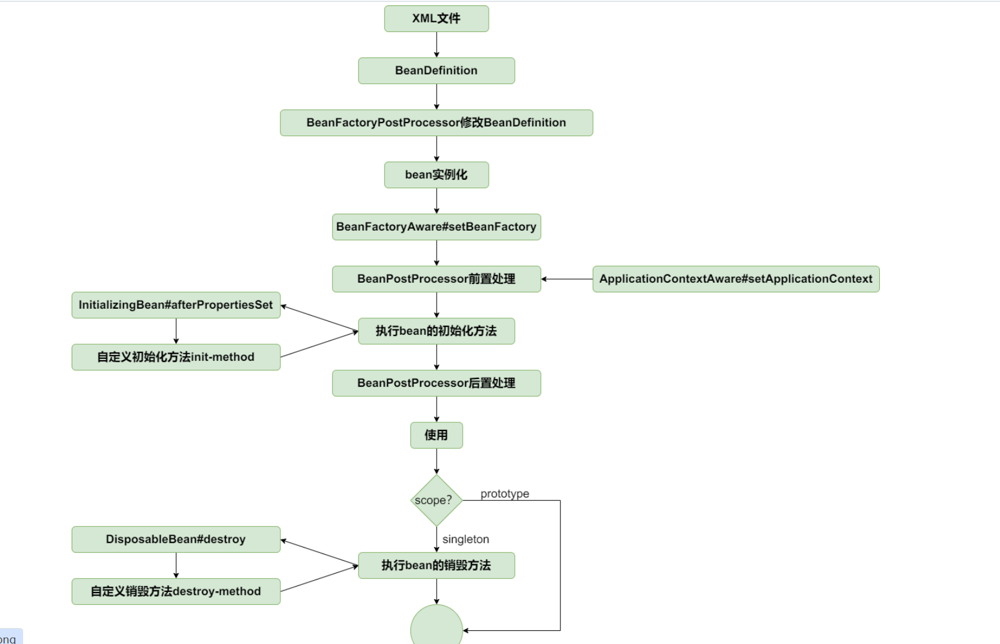
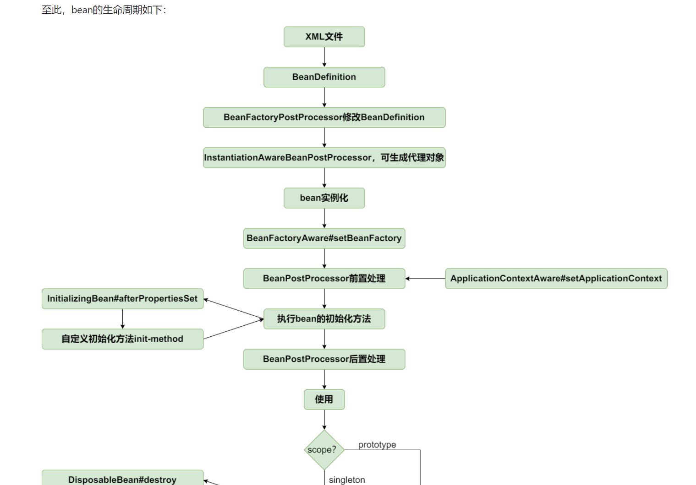

1、基础篇：IoC
    1.1 BeanFactory最简单的bean容器
    1.2 BeanDefinition和BeanDefinitionRegistry
        主要增加如下类：
        BeanDefinition，顾名思义，用于定义bean信息的类，包含bean的class类型、构造参数、属性值等信息，每个bean对应一个BeanDefinition的实例。简化BeanDefinition仅包含bean的class类型。
        BeanDefinitionRegistry，BeanDefinition注册表接口，定义注册BeanDefinition的方法。
        SingletonBeanRegistry及其实现类DefaultSingletonBeanRegistry，定义添加和获取单例bean的方法。
        bean容器作为BeanDefinitionRegistry和SingletonBeanRegistry的实现类，具备两者的能力。向bean容器中注册BeanDefinition后，使用bean时才会实例化。
        
    1.3 Bean实例化策略InstantiationStrategy
        现在bean是在AbstractAutowireCapableBeanFactory.doCreateBean方法中用beanClass.newInstance()来实例化，仅适用于bean有无参构造函数的情况。
        
        针对bean的实例化，抽象出一个实例化策略的接口InstantiationStrategy，有两个实现类：
        SimpleInstantiationStrategy，使用bean的构造函数来实例化
        CglibSubclassingInstantiationStrategy，使用CGLIB动态生成子类
    1.4 Bean属性填充策略
        在BeanDefinition中增加和bean属性对应的PropertyValues，实例化bean之后，为bean填充属性(AbstractAutowireCapableBeanFactory#applyPropertyValues)。
    1.5 为bean注入bean
        增加BeanReference类，包装一个bean对另一个bean的引用。
        实例化beanA后填充属性时，若PropertyValue#value为BeanReference，引用beanB，则先去实例化beanB。 
        由于不想增加代码的复杂度提高理解难度，暂时不支持循环依赖，后面会在高级篇中解决该问题。
    1.6 资源和资源加载器
        Resource是资源的抽象和访问接口，简单写了三个实现类
        
        FileSystemResource，文件系统资源的实现类
        ClassPathResource，classpath下资源的实现类
        UrlResource，对java.net.URL进行资源定位的实现类
        ResourceLoader接口则是资源查找定位策略的抽象，DefaultResourceLoader是其默认实现类
    1.7 在xml文件中定义bean
        有了资源加载器，就可以在xml格式配置文件中声明式地定义bean的信息，资源加载器读取xml文件，解析出bean的信息，然后往容器中注册BeanDefinition。
        BeanDefinitionReader是读取bean定义信息的抽象接口，XmlBeanDefinitionReader是从xml文件中读取的实现类。
        BeanDefinitionReader需要有获取资源的能力，且读取bean定义信息后需要往容器中注册BeanDefinition，因此BeanDefinitionReader的抽象实现类AbstractBeanDefinitionReader拥有ResourceLoader和BeanDefinitionRegistry两个属性。
        由于从xml文件中读取的内容是String类型，所以属性仅支持String类型和引用其他Bean。后面会讲到类型转换器，实现类型转换。
        为了方便后面的讲解和功能实现，并且尽量保持和spring中BeanFactory的继承层次一致，对BeanFactory的继承层次稍微做了调整。
        
    1.8 BeanFactoryPostProcessor和BeanPostProcessor  容器扩展机制
        BeanFactoryPostProcessor和BeanPostProcessor是spring框架中具有重量级地位的两个接口，理解了这两个接口的作用，基本就理解spring的核心原理了。
        为了降低理解难度分两个小节实现。
      1.8.1 BeanFactoryPostProcessor是spring提供的容器扩展机制，允许我们在bean实例化之前修改bean的定义信息即BeanDefinition的信息。
            BeanPostProcessor也是spring提供的容器扩展机制，不同于BeanFactoryPostProcessor的是，BeanPostProcessor在bean实例化后修改bean或替换bean。
            BeanPostProcessor是后面实现AOP的关键。
            BeanPostProcessor的两个方法分别在bean执行初始化方法（后面实现）之前和之后执行，理解其实现重点看单元测试
            
      1.8.2 引入ApplicationContext  能自动识别BeanFactoryPostProcessor和BeanPostProcessor，就可以在xml文件中配置而不需要手动添加到BeanFactory了。
            应用上下文ApplicationContext是spring中较之于BeanFactory更为先进的IOC容器，ApplicationContext除了拥有BeanFactory的所有功能外，还支持特殊类型bean如上一节中的BeanFactoryPostProcessor和BeanPostProcessor的自动识别、资源加载、容器事件和监听器、国际化支持、单例bean自动初始化等。
            BeanFactory是spring的基础设施，面向spring本身；而ApplicationContext面向spring的使用者，应用场合使用ApplicationContext。
            具体实现查看AbstractApplicationContext#refresh方法即可。注意BeanFactoryPostProcessor和BeanPostProcessor的自动识别，这样就可以在xml文件中配置二者而不需要像上一节一样手动添加到容器中了。
            
    1.9 bean的初始化和销毁方法
        在spring中，定义bean的初始化和销毁方法有三种方法：
        1、在xml文件中制定init-method和destroy-method
        <bean id="user" class="com.example.demo.User" init-method="init" destroy-method="destroy">  
        </bean>
        2、实现InitializingBean和DisposableBean接口
        3、在方法上加注解PostConstruct和PreDestroy 第三种通过BeanPostProcessor实现，在扩展篇中实现，本节只实现前两种。
        针对第一种在xml文件中指定初始化和销毁方法的方式，在BeanDefinition中增加属性initMethodName和destroyMethodName。
        初始化方法在AbstractAutowireCapableBeanFactory#invokeInitMethods执行。
        DefaultSingletonBeanRegistry中增加属性disposableBeans保存拥有销毁方法的bean，拥有销毁方法的bean在AbstractAutowireCapableBeanFactory#registerDisposableBeanIfNecessary中注册到disposableBeans中。
        为了确保销毁方法在虚拟机关闭之前执行，向虚拟机中注册一个钩子方法，查看AbstractApplicationContext#registerShutdownHook（非web应用需要手动调用该方法）。当然也可以手动调用ApplicationContext#close方法关闭容器。
        
    1.10 Aware接口
        Aware是感知、意识的意思，Aware接口是标记性接口，其实现子类能感知容器相关的对象。
        常用的Aware接口有BeanFactoryAware和ApplicationContextAware，分别能让其实现者感知所属的BeanFactory和ApplicationContext。
        让实现BeanFactoryAware接口的类能感知所属的BeanFactory，实现比较简单，查看AbstractAutowireCapableBeanFactory#initializeBean前三行。
        
    1.11 bean作用域，增加prototype的支持
        每次向容器获取prototype作用域bean时，容器都会创建一个新的实例。
        在BeanDefinition中增加描述bean的作用域的字段scope，创建prototype作用域bean时（AbstractAutowireCapableBeanFactory#doCreateBean），不往singletonObjects中增加该bean。prototype作用域bean不执行销毁方法，查看AbstractAutowireCapableBeanFactory#registerDisposableBeanIfNecessary方法。
        
    1.12 FactoryBean  
         FactoryBean是一种特殊的bean，当向容器获取该bean时，容器不是返回其本身，而是返回其FactoryBean#getObject方法的返回值，可通过编码方式定义复杂的bean
    1.13 容器事件和事件监听器
        ApplicationContext容器提供了完善的事件发布和事件监听功能。
        ApplicationEventMulticaster接口是注册监听器和发布事件的抽象接口，AbstractApplicationContext包含其实现类实例作为其属性，使得ApplicationContext容器具有注册监听器和发布事件的能力。
        在AbstractApplicationContext#refresh方法中，会实例化ApplicationEventMulticaster、注册监听器并发布容器刷新事件ContextRefreshedEvent；
        在AbstractApplicationContext#doClose方法中，发布容器关闭事件ContextClosedEvent。
2、AOP
    2.1 切点表达式
    2.2 基于JDK的动态代理
        AopProxy是获取代理对象的抽象接口，AopProxy是获取代理对象的抽象接口，JdkDynamicAopProxy的基于JDK动态代理的具体实现。TargetSource，被代理对象的封装。
        MethodInterceptor，方法拦截器，是AOP Alliance的"公民"，顾名思义，可以拦截方法，可在被代理执行的方法前后增加代理行为。
    2.3 基于CGLIB的动态代理 基于CGLIB的动态代理实现逻辑也比较简单，查看CglibAopProxy。
        与基于JDK的动态代理在运行期间为接口生成对象的代理对象不同，基于CGLIB的动态代理能在运行期间动态构建字节码的class文件，为类生成子类，因此被代理类不需要继承自任何接口。
    2.4 AOP代理工厂ProxyFactory
        增加AOP代理工厂ProxyFactory，由AdvisedSupport#proxyTargetClass属性决定使用JDK动态代理还是CGLIB动态代理。
    2.5 几种常用的Advice: BeforeAdvice/AfterAdvice/AfterReturningAdvice/ThrowsAdvice
        Spring将AOP联盟中的Advice细化出各种类型的Advice，常用的有BeforeAdvice/AfterAdvice/AfterReturningAdvice/ThrowsAdvice，我们可以通过扩展MethodInterceptor来实现
        只简单实现BeforeAdvice，有兴趣的同学可以帮忙实现另外几种Advice。定义MethodBeforeAdviceInterceptor拦截器，在执行被代理方法之前，先执行BeforeAdvice的方法。
        
    2.6 PointcutAdvisor：Pointcut和Advice的组合
        Advisor是包含一个Pointcut和一个Advice的组合，Pointcut用于捕获JoinPoint，Advice决定在JoinPoint执行某种操作。
        实现了一个支持aspectj表达式的AspectJExpressionPointcutAdvisor。
    2.7 动态代理融入bean生命周期
        结合前面讲解的bean的生命周期，BeanPostProcessor处理阶段可以修改和替换bean，正好可以在此阶段返回代理对象替换原对象。
        不过我们引入一种特殊的BeanPostProcessor——InstantiationAwareBeanPostProcessor，如果InstantiationAwareBeanPostProcessor处理阶段返回代理对象，会导致短路，不会继续走原来的创建bean的流程，具体实现查看AbstractAutowireCapableBeanFactory#resolveBeforeInstantiation
        DefaultAdvisorAutoProxyCreator是处理横切逻辑的织入返回代理对象的InstantiationAwareBeanPostProcessor实现类，当对象实例化时，生成代理对象并返回。
        
3.0 扩展篇
    3.1 经常需要将配置信息配置在properties文件中，然后在XML文件中以占位符的方式引用。
        实现思路很简单，在bean实例化之前，编辑BeanDefinition，解析XML文件中的占位符，然后用properties文件中的配置值替换占位符。
        而BeanFactoryPostProcessor具有编辑BeanDefinition的能力，因此PropertyPlaceholderConfigurer继承自BeanFactoryPostProcessor。
    3.2 包扫描
        结合bean的生命周期，包扫描只不过是扫描特定注解的类，提取类的相关信息组装成BeanDefinition注册到容器中。
        在XmlBeanDefinitionReader中解析<context:component-scan />标签，扫描类组装BeanDefinition然后注册到容器中的操作在ClassPathBeanDefinitionScanner#doScan中实现。
    3.3 @Value注解
        注解@Value和@Autowired通过BeanPostProcessor处理。InstantiationAwareBeanPostProcessor增加postProcessPropertyValues方法，在bean实例化之后设置属性之前执行，查看AbstractAutowireCapableBeanFactory#doCreateBean方法。
    3.4 没有为代理bean设置属性
        顺便完善spring的扩展机制，为InstantiationAwareBeanPostProcessor增加postProcessAfterInstantiation方法，该方法在bean实例化之后设置属性之前执行。
        
    3.5 类型转换（一）
        spring在org.springframework.core.convert.converter包中定义了三种类型转换器接口：Converter、ConverterFactory、GenericConverter。
    3.6 类型转换（二）
        上一节实现了spring中的类型转换体系，本节将类型转换的能力整合到容器中
4.0 高级篇   代码待完善
  4.1  循环依赖
   增加二级缓存，不能解决有代理对象时的循环依赖。原因是放进二级缓存earlySingletonObjects中的bean是实例化后的bean，而放进一级缓存singletonObjects中的bean是代理对象（代理对象在BeanPostProcessor#postProcessAfterInitialization中返回），两个缓存中的bean不一致。比如上面的例子，如果A被代理，那么B拿到的a是实例化后的A，而a是被代理后的对象，即b.getA() != a，见单测
  4.2  解决循环依赖问题（二）：有代理对象
   解决有代理对象时的循环依赖问题，需要提前暴露代理对象的引用，而不是暴露实例化后的bean的引用（这是上节的遗留问题的原因，应该提前暴露A的代理对象的引用）
  4.3 支持懒加载和多切面增强(By @zqczgl)
      事实上，并不是所有的bean在初始化容器的时候都会创建。随着项目规模的不断扩大，bean的数目也越来越多。如果每次启动容器都需要加载大量的bean，这无疑会带来大量的资源浪费。所有spring提供了懒加载机制，我们可以将我们认为暂时用不到的bean设为懒加载，这样只有在我们需要这个bean的时候这个bean才会被创建
  4.4 多个切面匹配同一方法
      虽然在前面我们完成了对方法的增强，但并不完美。
      我们的目前的代码只能支持对方法的单个增强。作为spring的核心功能如果不支持多切面的话有点太别扭了。spring利用了拦截器链来完成了对多个切面的支持。
      https://github.com/DerekYRC/mini-spring/blob/main/changelog.md